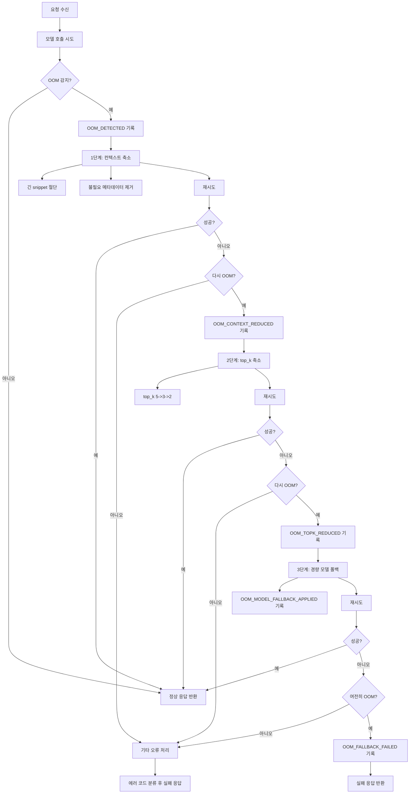

# BE3 성능/OOM 기준 메모 (Week 1 초안)

문서 버전: v0.1  
작성일: 2026-03-13  
작성자: BE3 김현석  
기준 문서: [be3_manual.md](../../30_manuals/be3_manual.md), [be3_error_codes.md](be3_error_codes.md), [be3_json_retry_strategy.md](be3_json_retry_strategy.md), [mvp_scope.md](../../00_overview/mvp_scope.md), [prd.md](../../00_overview/prd.md)

## 1. 문서 목적

이 문서는 BE3 관점에서 이번 주에 먼저 고정해야 할 성능 측정 기준과 OOM 대응 흐름을 정의한다.
목표는 다음과 같다.

- 2주차 이후 구현에서 같은 지표로 성능을 측정한다.
- OOM 발생 시 대응 순서를 표준화한다.
- 양자화(4-bit/8-bit)는 후순위로 두되, 측정 항목만 최소 정의한다.

## 2. 적용 범위

이번 문서 범위:

- `/api/v1/qa` 중심 성능 기준
- `/api/v1/search`, `/api/v1/structure` 보조 성능 기준
- OOM 감지 조건, 폴백 순서, 최종 실패 처리
- 양자화 비교용 측정 항목 정의(실험 자체는 후순위)

제외 범위(후순위):

- 본격 4-bit vs 8-bit 실험 수행
- 모델별 대규모 벤치마크
- 고급 프로파일링 도구 통합

## 3. KPI 및 운영 임계치

프로젝트 문서 기준과 Week 1 현실 기준을 함께 둔다.

### 3.1 목표 KPI (프로젝트 기준)

- E2E 응답 시간(질의 1건): 8초 이하
- 데모 안정성: 2시간 연속 재시작 0회

### 3.2 Week 1 운영 임계치 (초안)

- 경고 임계치:
  - `qa_total_latency_ms > 8000`
  - `search_latency_ms > 2000`
  - `structure_latency_ms > 3000`
- 실패 임계치:
  - `qa_total_latency_ms > 12000`
  - 모델 타임아웃 발생(`MODEL_TIMEOUT`)
  - OOM 발생 후 폴백 실패(`OOM_FALLBACK_FAILED`)

## 4. 측정 지표 정의

### 4.1 공통 지표

| 지표 | 설명 | 단위 |
| --- | --- | --- |
| request_count | 요청 수 | count |
| success_count | 성공 수 | count |
| failure_count | 실패 수 | count |
| p50_latency_ms | 지연 중앙값 | ms |
| p95_latency_ms | 상위 95% 지연 | ms |
| timeout_count | 타임아웃 수 | count |
| retry_count_avg | 평균 재시도 횟수 | count |

### 4.2 QA 세부 지표

| 지표 | 설명 | 단위 |
| --- | --- | --- |
| qa_total_latency_ms | 전체 응답 시간 | ms |
| retrieval_latency_ms | 검색 컨텍스트 확보 시간 | ms |
| llm_latency_ms | 모델 호출 시간 | ms |
| parse_latency_ms | JSON 파싱/검증 시간 | ms |
| citation_validation_latency_ms | citation 정합성 확인 시간 | ms |
| retry_attempts | 재시도 횟수 | count |
| parse_failure_rate | 파싱 실패율 | % |
| citation_error_rate | citation 오류율 | % |

### 4.3 메모리 지표

| 지표 | 설명 | 단위 |
| --- | --- | --- |
| rss_memory_mb | 프로세스 RSS 메모리 | MB |
| peak_memory_mb | 요청 처리 중 피크 메모리 | MB |
| gpu_memory_used_mb | GPU 사용량(가능 시) | MB |
| oom_event_count | OOM 이벤트 수 | count |

## 5. 로그 필드 표준

성능/OOM 이벤트는 아래 필드를 공통으로 남긴다.

- request_id
- endpoint
- model
- quantization_mode (예: unknown, 4bit, 8bit)
- context_size_chars
- retrieved_count
- top_k
- attempt
- latency_ms
- rss_memory_mb
- gpu_memory_used_mb (가능 시)
- error_code
- fallback_stage
- timestamp

## 6. 성능 계측 지점

### `/api/v1/qa`

계측 순서:

1. 요청 수신 시각 기록
2. retrieval 시작/종료
3. LLM 호출 시작/종료
4. JSON parse 시작/종료
5. citation 검증 시작/종료
6. 응답 반환 시각 기록

### `/api/v1/search`

계측 항목:

- 벡터 검색 실행 시간
- 필터 적용 시간
- 결과 직렬화 시간

### `/api/v1/structure`

계측 항목:

- 모델 추출 시간
- validation 시간
- 케이스당 평균 처리 시간

## 7. OOM 감지 기준

OOM은 아래 이벤트로 감지한다.

- Python `MemoryError`
- CUDA OOM 문자열 포함 예외
- 모델 호출 결과에서 메모리 부족 시그널 확인
- 시스템 메모리 임계치 초과(예: 사용 가능 메모리 급감)

대표 코드:

- `OOM_DETECTED`

## 8. OOM 대응 흐름도 초안

아래 순서로 폴백한다.

1. OOM 감지 (`OOM_DETECTED`)
2. 컨텍스트 축소
   - 긴 snippet 절단
   - 불필요 메타데이터 제거
   - 코드: `OOM_CONTEXT_REDUCED`
3. top_k 축소
   - 예: 5 -> 3 -> 2
   - 코드: `OOM_TOPK_REDUCED`
4. 모델 폴백
   - 더 가벼운 모델/설정으로 전환
   - 코드: `OOM_MODEL_FALLBACK_APPLIED`
5. 재요청 수행
6. 실패 시 최종 종료
   - 코드: `OOM_FALLBACK_FAILED`

### 8.1 Mermaid 흐름도

## 9. OOM 대응 의사결정 테이블

| 상황 | 조치 | 반환 |
| --- | --- | --- |
| 첫 OOM 발생 | 컨텍스트 축소 후 재시도 | warning + 재시도 |
| 두 번째 OOM | top_k 축소 후 재시도 | warning + 재시도 |
| 세 번째 OOM | 모델 폴백 후 재시도 | warning + 재시도 |
| 폴백 후에도 OOM | 처리 중단 | `OOM_FALLBACK_FAILED` |

## 10. 양자화 측정 기준 (후순위)

이번 주는 측정 항목 정의만 한다.

### 10.1 비교 항목

- `qa_total_latency_ms` (p50, p95)
- `llm_latency_ms`
- `peak_memory_mb`
- `oom_event_count`
- `parse_failure_rate`
- `citation_error_rate`
- 정성 메모: 답변 품질 저하 여부

### 10.2 실험 최소 템플릿

| mode | sample_count | p50(ms) | p95(ms) | peak_mem(MB) | oom_count | parse_fail(%) | note |
| --- | --- | --- | --- | --- | --- | --- | --- |
| 4bit | - | - | - | - | - | - | - |
| 8bit | - | - | - | - | - | - | - |

실험은 다른 핵심 작업 완료 후 진행한다.

## 11. 에러 코드 연계

성능/OOM 관련 핵심 코드는 아래를 사용한다.

- `PERF_LATENCY_THRESHOLD_EXCEEDED`
- `PERF_RETRIEVAL_SLOW`
- `PERF_PARSE_SLOW`
- `MODEL_TIMEOUT`
- `OOM_DETECTED`
- `OOM_CONTEXT_REDUCED`
- `OOM_TOPK_REDUCED`
- `OOM_MODEL_FALLBACK_APPLIED`
- `OOM_FALLBACK_FAILED`

## 12. 주간 운영 체크리스트

- p50, p95를 endpoint별로 기록했는가?
- parse_failure_rate, citation_error_rate를 분리 집계했는가?
- OOM 발생 시 fallback_stage가 로그에 남는가?
- retry 시도 횟수와 latency 상관관계를 확인했는가?
- 데모 시나리오 3종에서 12초 하드 상한을 넘지 않는가?

## 13. 이번 주 완료 기준

- 성능 지표 목록 동결
- 로그 필드 동결
- OOM 폴백 순서 동결
- 양자화 비교 항목 최소 정의 완료

## 14. 다음 작업 연결

문서 초안 단계 이후 다음은 구현 단계로 이어간다.

1. `app/generation/service.py`에 계측 포인트 삽입
2. parse/retry 루프에서 attempt, error_code, latency 로그 남기기
3. OOM 예외 캐치 및 fallback_stage 반영
4. `/api/v1/qa` 응답에 qa_validation 및 성능 메타 일부 포함 검토
