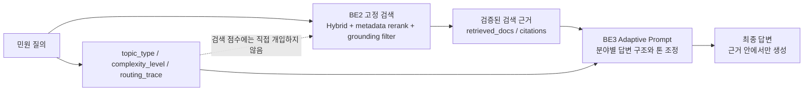

# BE2 검색 고정 Hybrid + 답변 Adaptive 역할 분리 결정

작성일: 2026-06-09
담당: BE2 검색
관련 이슈: #361

## 1. 결론 카드

BE2 검색 ranking은 **고정 Hybrid(BM25+Dense RRF)** 로 확정하고, topic/complexity 기반
adaptive 정보는 검색 순위를 바꾸는 데 쓰지 않고 **BE3 답변 프롬프트 힌트**로 넘긴다.

| 항목 | 결정 |
| --- | --- |
| 검색 ranking | 고정 Hybrid + metadata soft rerank + grounding filter |
| Adaptive 사용처 | 설명 가능성, routing trace, QA prompt hint |
| 검색에서 비추천 | topic/policy 기반 boost, hard filter, Adaptive ranking 재도입 |
| 이유 | 기존 평가에서 Adaptive 검색과 topic/policy boost가 안정적 이득을 보이지 못함 |
| BE2 책임 | 근거 품질과 citation 후보 안정화 |
| BE3 책임 | BE2 근거 안에서 topic/complexity에 맞는 답변 구조 생성 |

## 2. 한눈에 보는 구조

핵심은 검색과 답변의 역할을 분리하는 것이다.

- 검색은 정량 평가가 가장 좋은 고정 전략으로 안정화한다.
- adaptive 정보는 검색 결과를 바꾸는 위험한 레버가 아니라 답변을 분야에 맞게 쓰는 힌트로 사용한다.
- topic 오분류가 발생해도 검색 ranking 자체가 크게 망가지지 않게 한다.

## 3. 검색은 왜 고정 Hybrid인가

최종 canonical 평가(`qrels_pooled_3judge`, NO-self)에서 Hybrid가 BM25와 Dense보다 상위 검색
품질이 높았다.

| 전략 | nDCG@5 | P@5 | RR@5 | R@10 |
| --- | ---: | ---: | ---: | ---: |
| BM25 | 0.6952 | 0.7140 | 0.8158 | 0.2885 |
| Dense | 0.7325 | 0.7540 | 0.8642 | 0.3132 |
| Hybrid(BM25+Dense RRF) | **0.7522** | **0.7660** | **0.8762** | **0.3134** |

Hybrid 개선폭:

| 비교 | nDCG@5 | P@5 | RR@5 |
| --- | ---: | ---: | ---: |
| Hybrid - BM25 | +0.0570 | +0.0520 | +0.0603 |
| Hybrid - Dense | +0.0197 | +0.0120 | +0.0120 |

따라서 BE2 검색 성능 발표의 중심은 고정 Hybrid가 되는 것이 가장 설명 가능하다.

## 4. 왜 Adaptive 검색 ranking은 비추천인가

기존 Adaptive RAG 참고 평가에서는 Dense나 Hybrid 대비 안정적 이득이 확인되지 않았다.

| 근거 | 결과 | 판단 |
| --- | --- | --- |
| `split_analysis_latest` | Dense 대비 nDCG@10 -0.0185, R@10 -0.0257, latency +133.16s | Adaptive 검색 ranking 이득 부족 |
| Risk 3C 검증 | pure Dense 대비 nDCG@10 -0.0195, R@10 -0.0265, latency +78.78s | 현 Adaptive-Hybrid 계열 이득 없음 |
| 초기 49쿼리 gate | nDCG@5 개선폭 +0.0469, 기준 +0.05 미달 | 채택 기준 미통과 |
| policy boost 검증 | nDCG@10 -0.0181, R@10 -0.0240 | topic/policy boost 해로움 |

현재 코드도 이 판단을 반영한다.

- `routing_trace`, `topic_type`, `retrieval_policy`는 남긴다.
- `retrieval_policy` 기반 검색 점수 boost는 제거되어 metadata만 붙인다.
- 검색 ranking 개선은 topic boost가 아니라 Hybrid, metadata soft rerank, grounding filter 중심으로 관리한다.

## 5. Adaptive 정보는 어디에 쓰는가

Adaptive 정보를 버리는 것이 아니라, **검색 ranking이 아닌 답변 생성 보조 신호**로 쓴다.

| 필드 | BE2/BE3 사용처 | 쉽게 말하면 |
| --- | --- | --- |
| `topic_type` | PromptFactory topic guidance | 교통/복지/환경/건설 등 분야별 답변 방향 |
| `complexity_level` | PromptFactory complexity guidance | 단순 답변, 쟁점별 답변, 단계별 답변 깊이 |
| `request_segments` | 복합 요청 답변 구조 | 여러 요구사항을 빠뜨리지 않게 나눔 |
| `route_key` | trace, FE 표시, QA handoff | 어떤 처리 경로였는지 기록 |
| `strategy_id` | trace, FE 표시, QA handoff | 재현 가능한 전략 식별자 |
| `retrieval_policy` | PromptFactory policy guidance | 현장 대응형 또는 행정 절차형 답변 톤 |

예시:

| topic | 답변에서 강조할 방향 |
| --- | --- |
| `traffic` | 현장 확인, 단속 가능 여부, 시설물 조치, 안전 |
| `welfare` | 신청 자격, 필요 서류, 접수 절차, 지원 기준 |
| `construction` | 허가, 법령, 공사 기준, 담당 부서 |
| `environment` | 소음, 악취, 폐기물, 점검, 민원 처리 절차 |

## 6. BE2 -> BE3 Handoff 규칙

BE2는 검색 결과와 adaptive trace를 함께 넘기되, 둘의 역할을 분리한다.

| 전달 항목 | BE3 사용 규칙 |
| --- | --- |
| `retrieved_docs` / `citations` | 답변 근거. 이 안에서만 답변해야 한다. |
| `routing_trace.topic_type` | 답변 분야별 안내 구조를 고르는 힌트로 사용한다. |
| `routing_trace.complexity_level` | 답변 길이와 세부 단계를 정하는 힌트로 사용한다. |
| `routing_trace.request_segments` | 복합 민원 답변 섹션 분리에 사용한다. |
| `retrieval_policy` | 답변 톤 보조. 검색 점수 조정에는 재사용하지 않는다. |
| `grounding_filter` 결과 0건 | 가짜 답변을 만들지 않고 no-evidence fallback으로 처리한다. |

금지사항:

- topic이 `traffic`이라는 이유만으로 검색 결과를 강제로 교통 문서로 filter하지 않는다.
- `retrieval_policy`를 검색 점수 boost로 재도입하지 않는다.
- BE3는 BE2가 넘긴 근거 밖의 사례나 법령을 임의로 citation처럼 만들지 않는다.
- topic/complexity는 확정 분류가 아니라 답변 보조 신호로만 사용한다.

## 7. 최종 발표 문장

검색 단계에서는 정량 평가 결과 가장 안정적이었던 Hybrid(BM25+Dense RRF)를 고정 전략으로
채택했다. Adaptive RAG는 검색 순위 개선보다는 답변 생성 단계에서 더 효과적이라고 판단해,
topic과 complexity 정보는 검색 결과를 바꾸는 데 쓰지 않고 답변 프롬프트를 조정하는
힌트로 활용했다.

따라서 BE2는 검색 품질과 근거 안정성을 책임지고, BE3는 BE2가 넘긴 근거 안에서
topic/complexity에 맞는 답변 구조를 생성한다.

## 8. 근거 이슈와 PR

| 구분 | 근거 |
| --- | --- |
| topic-aware retrieval trace 도입 | #168, PR #182 |
| TopicAnalyzer 독립화 | PR #206 |
| Adaptive topic mapping 보강 | #234, PR #240 |
| Adaptive 검색 경량화와 policy boost 제거 | #263, PR #266 |
| BE1 metadata soft rerank | #316, PR #319 |
| Adaptive RAG 비교 평가 정리 | #358, PR #359 |
| BE3 PromptFactory topic/complexity 사용 | #169, #251 |

## 9. 근거 산출물

| 용도 | 파일 |
| --- | --- |
| Adaptive Router 가치 재평가 | `docs/50_issues/adaptive_router_decision.md` |
| Adaptive RAG 비교 평가 | `docs/40_delivery/BE2_adaptive_rag_comparison.md` |
| BE2 최종 KPI | `docs/40_delivery/BE2_final_kpi_snapshot.md` |
| 최종 Hybrid 평가 | `reports/retrieval/v3/eval_hybrid_noself.json` |
| metadata soft rerank 평가 | `reports/retrieval/v3/metadata_soft_rerank_summary.md` |
| policy boost 영향 | `reports/retrieval/v3/risk3c_policy_boost_impact.json` |
| grounding filter 효과 | `reports/retrieval/v3/grounding_filter_effect.json` |
| BE3 handoff | `docs/40_delivery/BE3_handoff.md` |

## 10. 후속으로 남길 수 있는 일

Adaptive를 검색 ranking에 다시 쓰려면 바로 구현하지 말고 먼저 oracle 분석을 해야 한다.

1. 쿼리별로 BM25, Dense, Hybrid 중 어느 전략이 이겼는지 분류한다.
2. topic/complexity/query_signals별로 반복 패턴이 있는지 확인한다.
3. 패턴이 있을 때만 Adaptive Router 전략 선택 규칙을 실험한다.
4. 튜닝셋과 검증셋을 분리해 과적합 여부를 확인한다.

현재 BE2 마감 기준에서는 위 작업은 후속 연구로 두고, 본선 전략은 고정 Hybrid로 유지한다.
